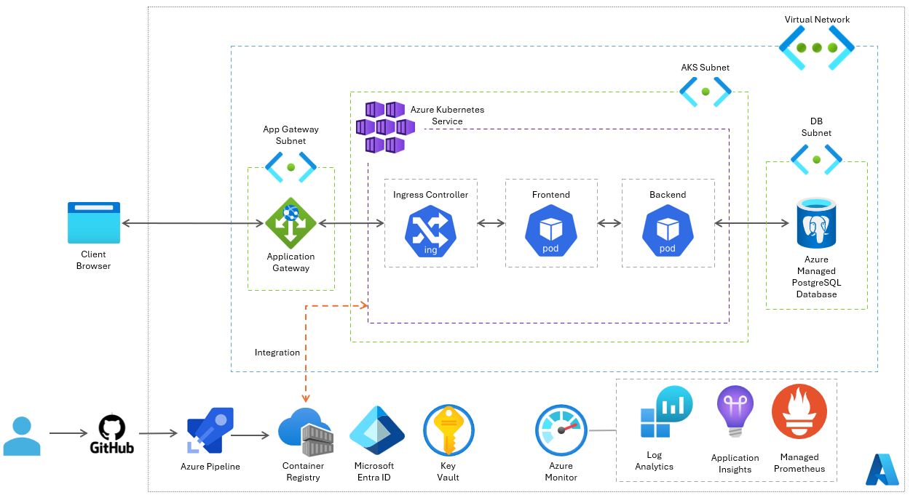

# Azure Cloud Architecture Design

## 1. Azure Fundamentals

The following core Azure services have been chosen for trading applications:

- **Azure Pipelines:** for building and pushing Docker images to the registry 
- **Azure Container Registry:** for storing and managing container images
- **Azure Kubernetes Service:** for deploying and managing application containers
- **Application Gateway:** for load balancing and point of entry for external requests
- **Managed PostgreSQL Database:** for data storage 
- **Azure Monitor:** for comprehensive full stack monitoring
  - **Application Insights:** for monitoring live web applications
  - **Log Analytics:** for analysing log and performance data 
  - **Prometheus:** for monitoring AKS and alerts
- **Microsoft Entra ID:** for user authentication and fine-grained access control
- **Key Vault:** for secure management of sensitive information such as secrets, API key, passwords etc.

Azure Kubernetes Service (AKS) has been selected for computing as it provides a fully managed option in Azure. This helps to reduce operational effort needed for Kubernetes orchestration as complex tasks required for infrastructure are managed by Azure. 

Although Azure App service is easier to use and provides a more efficient way of building and deploying web applications in comparison to AKS, AKS is more flexible and better suited to the large-scale nature of this full stack trading application. It is highly scalable, able to adapt to potentially increasing workloads in the future and able to perform seamless updates without impacting end user experience, particularly important as the application requires 24/7 availability.

**Summary of Differences**

| Feature           | Azure Kubernetes Services                  | Azure App Service         | Azure Container Apps                         |
|-------------------|--------------------------------------------|:--------------------------|:---------------------------------------------|
| Best for          | Complex, scalable, custom workloads        | Web apps, APIs, backends  | Microservices, event-driven, jobs            |
| Management        | You manage (with Azure help)               | Fully managed             | Fully managed, serverless                    |
| Scaling           | Manual/auto (pods, nodes)                  | Auto (HTTP traffic)       | Auto (HTTP/events, scale to zero)            |
| API Access        | Full Kubernetes API                        | No infra access           | No Kubernetes API                            |
| Networking        | Advanced, customisable                     | Basic (web-centric)       | Basic, with VNet integration                 |
| Use cases         | Hybrid/multi-cloud, regulated, large-scale | Web, REST APIs, mobile    | Microservices, event-driven, background jobs |
| Learning curve    | Steep (Kubernetes skills needed)           | Low                       | Low-medium                                   |
| Pricing           | Pay for nodes (even idle)                  | Pay for plan (fixed/auto) | Pay for usage (scale to zero)                |
| CI/CD Integration | Azure DevOps, GitHub, custom               | Azure DevOps, GitHub      | Azure DevOps, GitHub                         |
_Source:_ [Microsoft Community Hub](https://techcommunity.microsoft.com/blog/appsonazureblog/choosing-the-right-azure-containerisation-strategy-aks-app-service-or-container-/4456645)

Resources are to be managed in one subscription and three resource groups, one for AKS, one for Managed PostgreSQL database and one for Virtual Network together with Application Gateway due to their different lifecycles. Having one subscription for trading applications in production will enable granular cost tracking. Role based access control can also be applied to ensure users, groups and applications to limit privileges to the minimum they require.

## 2. Architecture Design
The chosen database is PostgreSQL as the trading application uses the Hibernate Framework which is designed to work with relational databases that have strict schema and can guarantee all database transactions are processed in a reliable way (ACID properties). The application also relies on complex queries and data aggregation which are better supported with PostgreSQL than Cosmos DB. Azure SQL is also a suitable option, but it provides less flexibility for customisation and higher licensing costs in comparison to PostgreSQL. 

## 3. Deployment Strategy

The deployment strategy utilises Azure Pipeline to build Docker images from the source code in GitHub.  Multistep tasks can be triggered to automate the building, running and testing of container images. 

Docker images will be pushed to Azure Container Registry and automatically scanned for vulnerabilities using Defender for Containers. The AKS cluster will be configured with managed identity authentication to ACR, eliminating the need for manual credential management. Kubernetes manifests will be deployed through Azure Pipelines CD stages, ensuring declarative and auditable deployments.

A multi-region deployment approach is to be adopted to protect trading applications from a complete Azure region failure. Azure Container Registry geo-replication will help to keep container images consistent across regions. This approach will also require geo-replication of Managed PostgreSQL databases in the same regions.

## 4. Operations and Monitoring 

To ensure robust monitoring and operational oversight, custom KPI dashboards are to be utilised to track key performance metrics such as trade volumes and average transaction times. The Azure Monitor service on AKS automatically collects all necessary logs and metrics, providing comprehensive observability into application performance. Alerts for critical issues can be configured in the Log Analytics Workspace or through Azure-managed Prometheus service for metrics, ensuring timely notification of critical issues. AKS provides service availability within the region, providing a resilient infrastructure foundation, while the application's availability is ultimately dependent on the quality of the build and deployment processes.

## 5. Cost and Governance

Azure Policies can be used to automatically enforce organisational standards and Azure Purview Compliance Manager to ensure adherence to regulatory standards. Application quality control will be managed through comprehensive application testing, incorporating both static code analysis to identify potential vulnerabilities early in the development lifecycle and dynamic/runtime analysis, which includes scanning libraries for known security issues. Implementation of Role-Based Access Control (RBAC) at the user, service account, and resource levels to apply the principle of least privilege will be important for managing access control.

For cost management and optimisation, Azure Cost Management will be utilised to set budgets thresholds and complemented by the use of resource tags for organising, tracking, and accurately attributing costs and billing. Alerts will be configured for subscription costs which helps prevent unexpected expenses.
